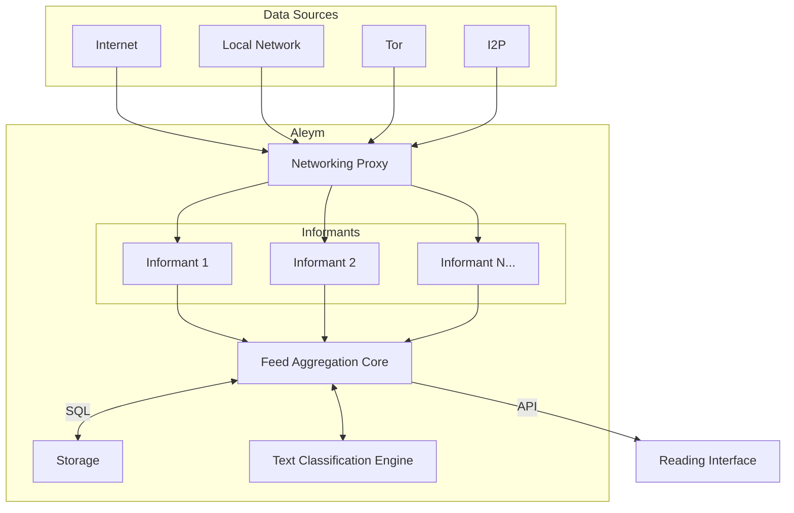

# Architecture

## System Overview

```mermaid
graph TD
    subgraph Data Sources
        D1[Internet]
        D2[Local Network]
        D3[Tor]
        D4[I2P]
    end

    subgraph Aleym
        subgraph Informants
            A1[Informant 1]
            A2[Informant 2]
            A3[Informant N...]
        end

        N[Networking Proxy]
        N --> A1
        N --> A2
        N --> A3
        D1 --> N
        D2 --> N
        D3 --> N
        D4 --> N
        A1 --> B[Feed Aggregation Core]
        A2 --> B
        A3 --> B
        B <-->|SQL| E[Storage]
        B <--> F[Text Classification Engine]
    end
    B -->|API| C[Reading Interface]
```

TODO...
